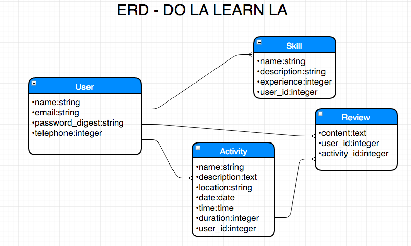
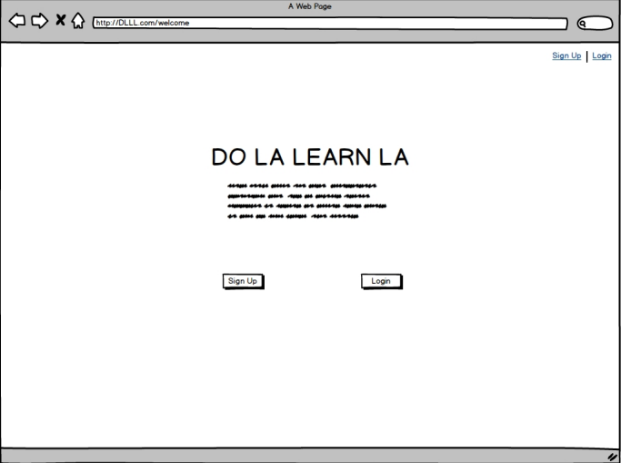
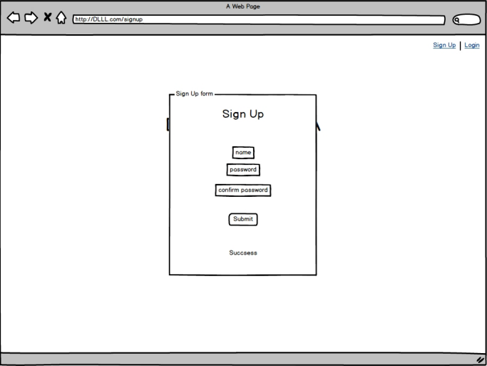
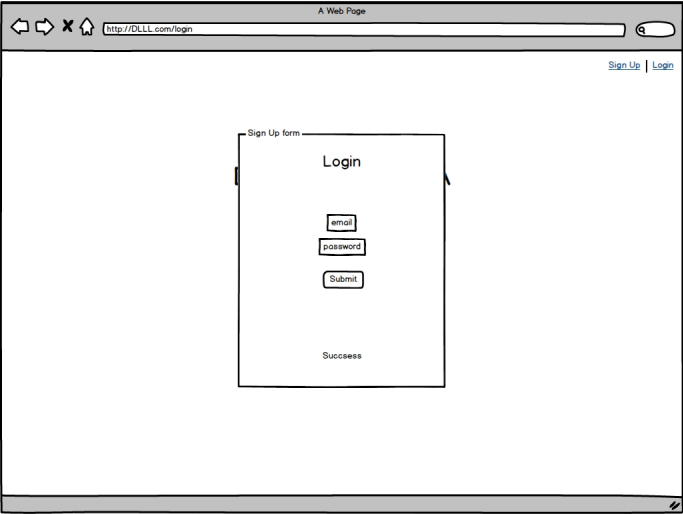
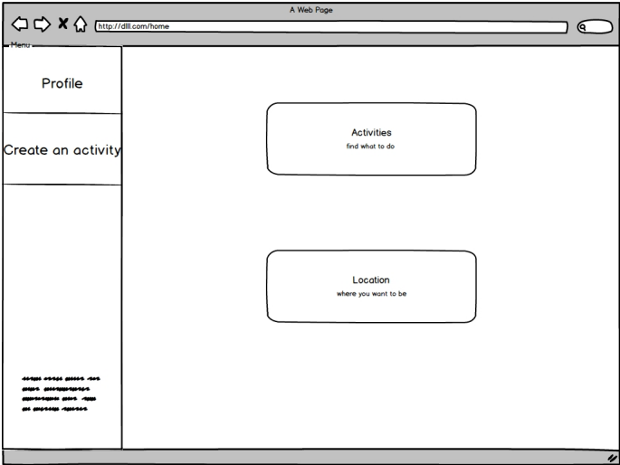
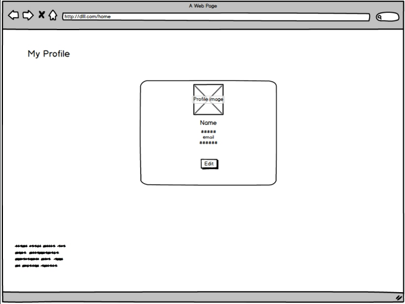
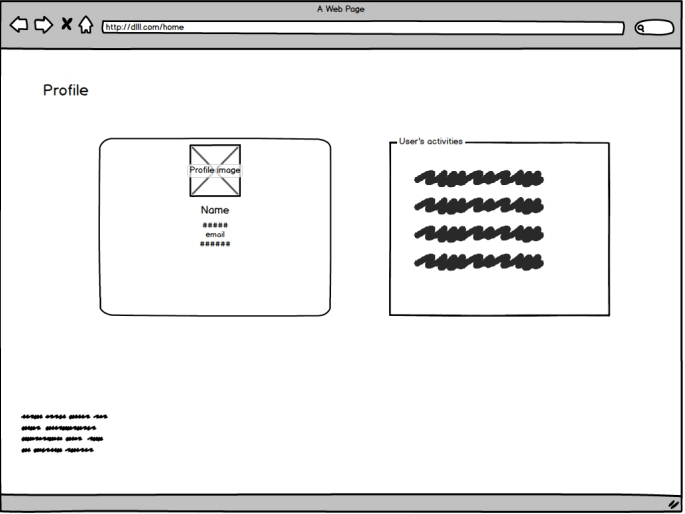
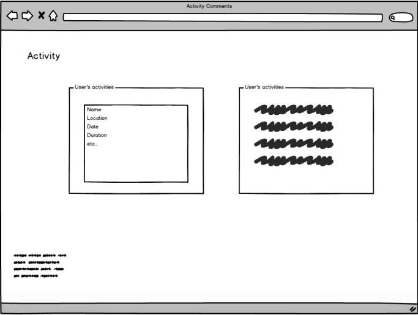

# DLLL

### Description:

Do LA learn LA (DLLL) is a web application I created as a second project for the WDI course at General Assembly downtown Los Angeles.

DLLL is a platform that connects people living or visiting LA, where users can offer different kind of services. 

The app is currently being deployed at: https://tranquil-reef-35527.herokuapp.com/

### Entity Relationship Diagram:

### WIREFRAMES:

### Technologies Used

The app was boilt using Ruby on Rails 2.2.3 with a Postgresql database.

For specific tasks extra gemfiles were installed:

| Gemfile           | Goal                                     |
| ----------------- | ---------------------------------------- |
| bcrypt            | Use secure passwords by encrypting them and storing the keys. |
| paperclip         | allows to upload images to the models    |
| twitter-bootstrap | Styling helper                           |
| was-sd            | Amazon web service for image storing     |

### Installations Instructions

Clone the repo https://github.com/vanpeta/project_2.git from your terminal or go to https://github.com/vanpeta/project_2 and click fork.

Install the gems by running bundle install

Create and migrate a database by running rake db:create rake db:seed

Last, runrails server with rails s and go to your browser to localhost:3000.

You also will need to set up an Amazon Web Service Account.

- Unsolved problems, etc.

